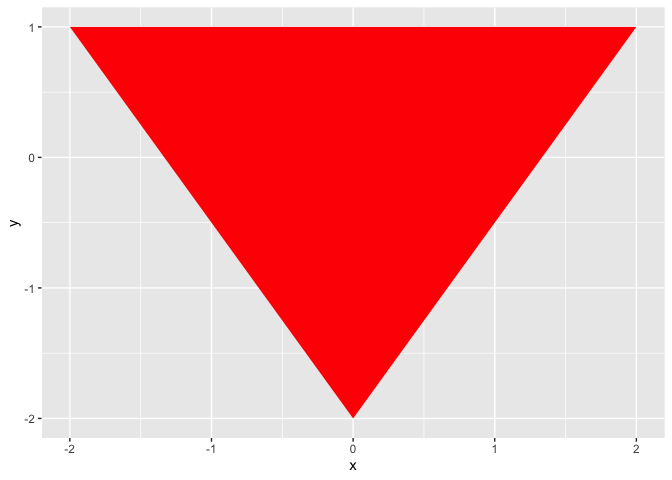
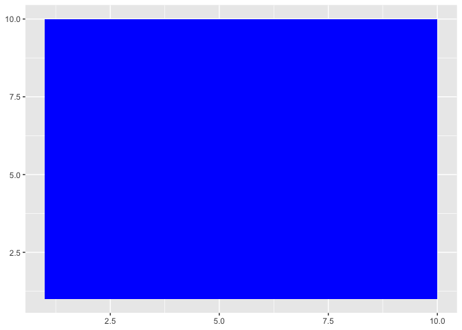

Answer7_8\_9
================
Jacob Oh
2022-10-01

``` r
# Load necessary packages.
library(ggplot2)
```

## Drawing Triangle

To draw an triangle, we use geom_polygon function.

``` r
library(ggplot2)

x1 <- c( 0, 2, -2)
y1 <- c(-2, 1,  1)

ggplot() + 
  geom_polygon(data = data.frame(x = x1, y = y1), aes(x = x, y = y), fill="red")
```

<!-- -->

## Drawing Rectangle

To draw an rectangle, we use geom_rect function.

``` r
library(ggplot2)

ggplot() + 
  geom_rect(aes(xmin = 1, xmax = 10, ymin = 1, ymax = 10), fill='blue')
```

<!-- -->
